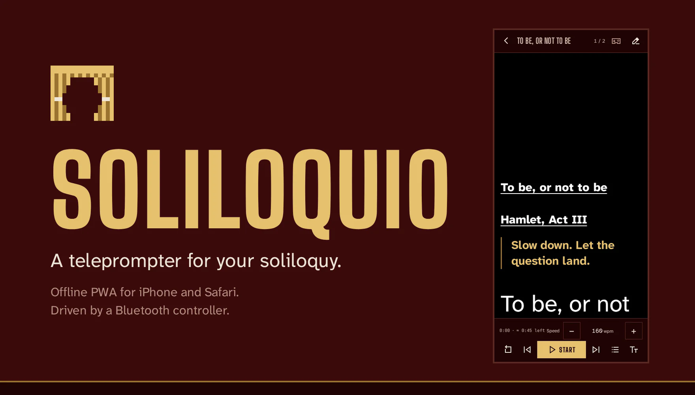
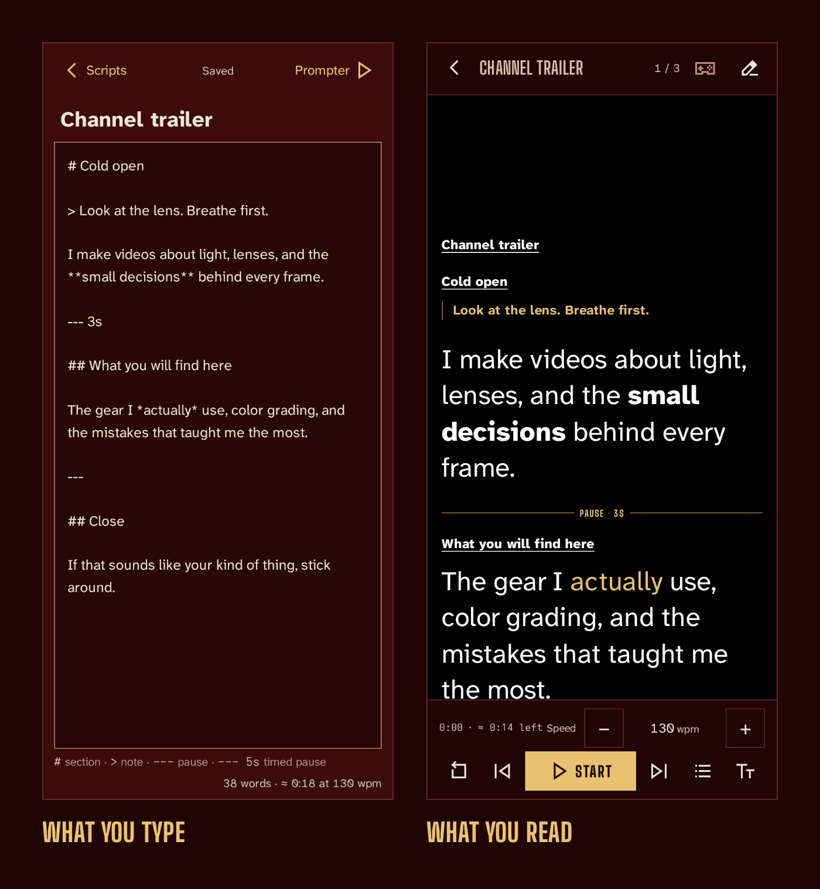
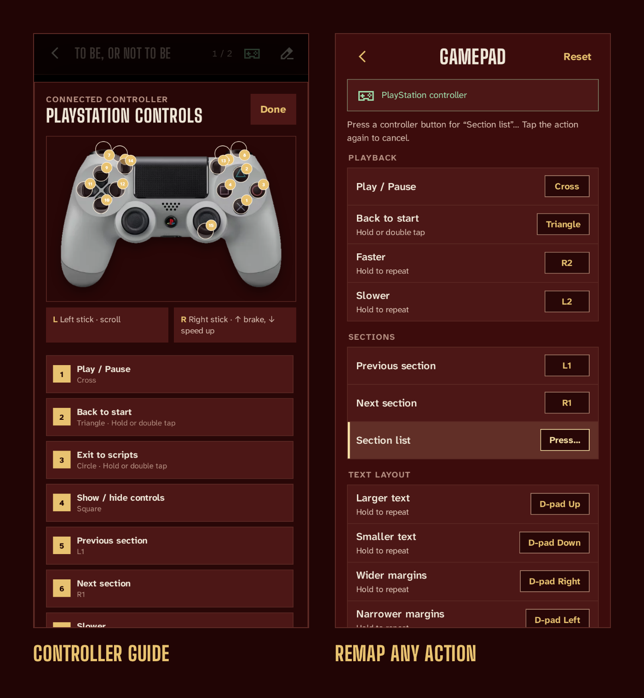
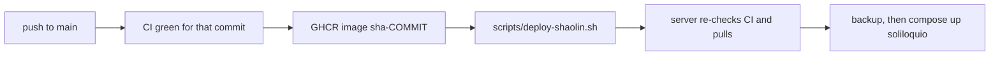

<p align="center">
  <a href="https://soli.vondiego.com"></a>
</p>

<p align="center">
  <a href="https://soli.vondiego.com"><b>soli.vondiego.com</b></a>
  &nbsp;
  <a href="https://github.com/donutinit/soliloquio/actions/workflows/ci.yml"></a>
  <a href="LICENSE"></a>
</p>

Soliloquio is a teleprompter that runs in the browser and keeps working offline. It was made for
an iPhone mounted next to the camera lens, with a Bluetooth controller running the take. There is
no backend, account, sync, or analytics: scripts and settings live in the browser's IndexedDB on
that one device.

The intended workflow is short. Keep your scripts wherever you already keep documents, import them
right before recording, press START, and talk to the lens. When the session is over you can clear
the library, because nothing in it should be the only copy.


[Install](#install) · [Write a script](#write-a-script) · [Import](#import-documents) ·
[Read](#read) · [Controllers](#controllers) · [Your data](#your-data) ·
[Troubleshooting](#troubleshooting) · [Development](#development) ·
[Deployment](#container-image-and-deployment)

## Install

Open [soli.vondiego.com](https://soli.vondiego.com).

On iPhone, open it in Safari, tap Share, then Add to Home Screen. The installed app opens full
screen and works offline. On Android and desktop, use the browser's Install app or Add to Home
screen action when it offers one.

The app also works in a regular browser tab. Scripts and settings stay in the local storage of the
browser that created them.

## Write a script

Tap the + button in the library to write a script, or [import a document](#import-documents). Scripts are
Markdown, and a few marks change how the reader behaves:

| You write | The reader |
|---|---|
| `# Heading`, `## Heading` | Starts a section you can jump to from the section list, the arrow keys, or L1 and R1 |
| `> Look at the lens` | Shows a small gold note. Notes don't count as spoken words |
| `---` on its own line | Stops scrolling when the line reaches the reading area. START continues |
| `--- 5s` | Holds for five seconds (sixty at most), then keeps going on its own |
| `**bold**`, `*italic*` | Keeps the emphasis visible |

Leave a blank line above a plain `---`. Right under a line of text, Markdown reads it as the
underline of a heading.

<p align="center">
  , bold and italic marks, a --- 3s timed pause, and a plain --- pause. The reader shows the title and heading underlined, the note in gold, 'small decisions' in bold, a thin line labeled PAUSE · 3S, and 'actually' in italic gold.">
</p>

The script title is the first line in the reader. The title and every heading are underlined at
half the reading size. Plain-text scripts are shown exactly as written, and you can convert one to
Markdown from its options menu.

In the editor:

- The footer shows the word count, the reading time at the current speed, and a one-line reminder
  of the marks above.
- Text saves after a short pause and whenever the app goes to the background. The Scripts and
  Prompter buttons wait for the save to finish before they leave.
- An empty script offers Paste from clipboard. If the script has no title yet, the first pasted
  line becomes the title.
- Only a new script puts the cursor in the title, so opening an existing one doesn't bring up the
  keyboard. A new script you leave empty is discarded.

In the library:

- Cards are sorted by title with natural number order, so `VID2` comes before `VID10`. Each card
  shows the spoken word count and the reading time at the current speed.
- A fresh install includes a Read me first script pinned to the bottom. If you delete it, it
  stays deleted until a factory reset.
- The options menu (⋯) exports, duplicates, deletes, or converts a script, and stays open until
  the write finishes. Deleting asks for a second tap.
- The search field appears once the library holds six or more scripts. An empty library offers
  Import and New script right away.
- App settings has One card per row (on by default) and the size of card titles (25 px by
  default), which helps when you read the library from a distance.

## Import documents

The import button opens the system file picker straight from your tap, which is what installed
iOS web apps need to show it reliably. On a computer you can also drop files anywhere on the
library. Every conversion runs on the device. PDF.js loads the first time you import a PDF and is
then cached for offline use.

| Format | Extensions | What you get |
|---|---|---|
| Markdown | `.md` `.markdown` `.mdown` `.mkd` `.mkdn` | The exact text. Only a leading YAML front matter block is dropped |
| Plain text | `.txt` `.text` `.fountain` | The exact text |
| Word | `.docx` `.docm` `.dotx` | Headings become sections; bold and italic are kept |
| OpenDocument | `.odt` `.ott` | Same as Word |
| HTML | `.html` `.htm` `.xhtml` | Same as Word |
| PDF | `.pdf` | Plain text with rebuilt paragraphs |
| RTF | `.rtf` | Plain text with rebuilt paragraphs |
| Subtitles | `.srt` `.vtt` | Plain text with rebuilt paragraphs |
| Soliloquio backup | `.json` | Scripts and preferences, see [Backups](#backups) |

A file with any other extension imports as plain text if its bytes are valid UTF-8. Images, audio,
video, and archives are rejected. Legacy Word (`.doc`), Pages, and presentations get a message that
asks you to export them as `.docx` or PDF first. Scanned PDFs without selectable text and
password-protected PDFs are reported file by file.

Only Markdown and plain text are guaranteed to import exactly. The other formats describe a page
layout instead of a reading order, so their conversion is a best effort. It is deterministic (the
same file always gives the same text), but it can differ from what you see in Word or a PDF viewer.
PDF is the weakest case: it stores positioned glyphs with no paragraphs, so columns, headers,
footnotes, tables, and hyphenation are rebuilt by heuristics and can merge or come out of order.
Word, OpenDocument, and HTML work well for simple linear documents, but they drop or flatten tables,
text boxes, footnotes, list numbering, and comments. For a script you plan to record, use `.md` or
`.txt`, or check the imported text in the editor before you read it.

One selection can hold up to 50 script files, with 5 MB per text file, 25 MB per Word, PDF,
OpenDocument, or RTF document, 50 MB in total, and 5 MB of extracted text per file. A backup can be
up to 25 MB. While files convert, the library shows which file of the selection it is working on.
Large scripts are parsed in a background worker when the browser supports it, and long plain-text
scripts are grouped into reading blocks instead of one element per short paragraph.

## Read

Tap a card to open it in the reader. Scripts always open at the beginning, since reading positions
are not saved.

Press START. Scrolling eases up to speed over half a second (also after a pause or a timed
hold), the header hides, and the playback bar fades out after one second. Tap the text to bring the
bar back. The bar shows the elapsed time, timed pauses included, and the estimated time left.
Elapsed time resets when you go back to the start, and the bar comes back by itself at the end of
the script.

You can drag the text, use a mouse wheel or trackpad, or use a keyboard:

| Key | Action |
|---|---|
| Space | Start or pause |
| ↑ ↓ | Scroll |
| Page Up, Page Down | Scroll farther |
| Home, End | Jump to the start or the end |
| ← → | Previous or next section |
| `+` `-` | Faster or slower |
| Tab | Show the controls and focus START |

Shortcuts leave text fields and sliders to their normal keys.

Display, in the playback bar, holds the settings that shape the reading. Every script uses the
same ones.

- Speed is in words per minute, from 40 to 300 (130 by default). The app converts it through
  the measured layout, so larger text or wider margins keep the same pace. Speeds that older
  versions saved in pixels per second are migrated to an equal pace. The playback bar also has
  minus and plus buttons for speed.
- Text size (60 px by default) and margins.
- Mirror text flips the reader horizontally for beam-splitter teleprompter glass. The same
  switch is in App settings.
- Fit to time sets the speed so the script lasts 0:30, 1:00, 1:30, 2:00, or 3:00, counting
  timed pauses. When that needs a pace outside 40 to 300 wpm, it uses the closest one and tells you
  the resulting length.

App settings has the rest:

- A start countdown from 0 to 10 seconds. It is off by default. When it's on, it runs every
  time scrolling starts, including after a pause.
- Keep screen awake (on by default) holds a screen wake lock anywhere in the app and takes it
  again after the app returns from the background, when the browser allows it.
- The Quick guide, the gamepad configuration, backups, Remove all scripts, Update app, and
  Factory reset.

Scripts without headings hide the section indicator and the section buttons.

## Controllers


With the phone mounted next to the lens, a controller in your hand, on the desk, or a small 8BitDo
Micro held out of frame runs the whole take. You start and pause from where you stand, without
walking to the phone or breaking eyeline. The left stick scrubs back for a retake. The right stick
works as a brake and accelerator on running playback, and it never runs the text backwards. Speed,
text size, and margins change without opening a panel: the new value appears in the middle of the
screen and fades away.

Each button does one thing. Going back to the start and leaving the reader take a hold or a double
tap, so a stray press doesn't lose your place in the middle of a take. Play and pause from the
controller leave the controls as they were; the show/hide button brings them back.

### Connect a controller

Pair it in the system's Bluetooth settings. For a DualShock 4, hold PS and Share until the
light bar flashes. Then open the app and press any button: browsers only expose a controller after
a button press while the page is in the foreground.

The app identifies PlayStation, Xbox, Nintendo, and 8BitDo controllers from the id the browser
reports, and uses their button names in the Gamepad settings. Detection is a best guess. Some
controllers report themselves as Xbox in XInput mode, and unknown ones fall back to numbered
buttons.

### Default layout

| Control | Action |
|---|---|
| Cross | Play or pause |
| Triangle, hold or double tap | Back to the start (a single tap does nothing) |
| Circle, hold or double tap | Back to Scripts (a single tap does nothing) |
| Square | Show or hide the controls |
| L1, R1 | Previous or next section |
| L2, R2 | Slower or faster; hold to repeat |
| D-pad up, down | Larger or smaller text; hold to repeat |
| D-pad left, right | Narrower or wider margins; hold to repeat |
| Left stick | Scroll up or down, in proportion to the tilt |
| Right stick | Up brakes playback down to a full stop; down speeds it up to 3× |
| Options, Menu, Plus, or Start | Display settings |
| Share, Create, View, Minus, or Select | Controller guide |
| R3 | Section list |

The right stick only changes the pace of running playback and does nothing while paused. Letting
go returns to the configured speed. Hold actions fire after 0.6 seconds, or on a second tap within
0.4 seconds.

### Remap buttons

Open App settings > Gamepad > Configure, tap an action, and press the button you want for it.
Assigning a button that another action already uses swaps the two, so no button ends up with two
jobs. Hold behaviors travel with the action to its new button, and Reset brings back the
default layout. Button numbering varies between browsers and controllers; Diagnostics shows
the raw buttons and axes the browser reports and pauses controller input while it's open. Stick
axes work on controllers that report the standard mapping.

The controller guide opens from the reader with Share (or its equivalent). It draws the matching
controller for DualShock 4, Xbox, 8BitDo Micro, and 8BitDo Pro 3, with numbered pins that follow
your current mapping. Other controllers get a generic layout.

<p align="center">
  
</p>

### Move around the app

A connected controller also drives the library, the settings, and every panel. The d-pad or left
stick moves the focus, the bottom face button (Cross, Xbox A, Nintendo B) activates, and the right
one (Circle, Xbox B, Nintendo A) closes the open panel. These navigation buttons are fixed.

When the app first detects a controller in the library, focus jumps to the first script. If it
first detects it in the reader, the press that woke it already controls playback. While a reader
panel is open (Display, Sections, or the controller guide), the controller moves through that
panel instead of triggering reader actions, and d-pad left and right adjust sliders. On iOS the
file picker still needs a tap on the screen.

<details>
<summary><b>8BitDo Micro profile</b></summary>

When the reported id identifies an 8BitDo Micro, the app switches to a fixed compact profile.
Other controllers keep their own layout.

| Micro control | Reader action |
|---|---|
| D-pad left, right | Scroll up or down |
| Hold D-pad up, down | Play at 20% or 200% of the configured speed while held |
| Hold Select + D-pad up, down | Larger or smaller text; hold to repeat |
| Hold Select + D-pad left, right | Narrower or wider margins; hold to repeat |
| Select + B | Open or close the section list |
| Select, tapped | Controller guide |
| Start | Display settings |

Select and the D-pad are reserved while the profile is active. Releasing a temporary speed button
returns to the normal speed, or stops again if the reader was paused. A Select combination uses up
both controls, so releasing it doesn't also open the guide or trigger the other button's action.

The face buttons keep the same positions as on a DualShock: B plays or pauses, holding or double
tapping A exits, Y shows or hides the controls, and holding or double tapping X goes back to the
start. The Micro's raw A/B/X/Y order is normalized only in this profile; Diagnostics still shows
the raw input.

</details>

<details>
<summary><b>8BitDo Pro 3 profile</b></summary>

The Pro 3 reports its face buttons to Apple browsers in A/B/X/Y letter order instead of the
standard order by position. Its profile normalizes them, so B at the bottom (Nintendo layout)
confirms or plays and A on the right goes back or exits.

Native software such as Steam can read the Pro 3's L4, R4, PL, and PR separately, but WebKit builds
Safari's gamepad button list from the standard controls only. The app gets around this with four
virtual buttons that you set up with the controller's own multi-button mapping:

| Extra control | Map it on the Pro 3 to |
|---|---|
| L4 | Select + A |
| R4 | Select + B |
| PL | Select + X |
| PR | Select + Y |

For each row, hold the extra control and the listed buttons, then press Star to save the mapping.
After that, assign each extra in App settings > Gamepad like any other button. The app
recognizes the combinations as L4, R4, PL, and PR, and consumes their component buttons so they
don't also trigger Select or a face-button action. Browsers that expose more raw button indexes
work directly.

</details>

## Your data

IndexedDB in the current browser is the only copy of your scripts; there is no server copy to
recover from. The app asks the browser for persistent storage after the first script is created or
imported, and the browser may decline. Clearing site data deletes the library. iOS may also clear
Safari's site data after a long time without use, and an app installed on the Home Screen usually
holds up better. Removing the installed app can remove its scripts too.

If a save is still pending when you close a browser tab, browsers that support it warn you first.

### Backups

- App settings > Library > Export backup saves every script and preference to one JSON file.
  A single script exports from its options menu.
- Importing a backup merges its scripts into the library and restores its preferences, in a single
  transaction.
- Remove all scripts empties the library after a recording session and keeps every setting.
  Like deleting one script, it asks for a second tap.
- Factory reset, behind a confirmation, erases scripts and preferences in one transaction and
  restores the first-run state: the Read me first script and the default settings.

### Updates

Soliloquio checks for a new version when it opens, when it returns to the foreground, and after a
factory reset. It doesn't poll in between. A new version installs by itself once pending changes
are saved. Update app, in App settings, asks the server right away.

## Browser support

- The app targets current desktop, Android, and iOS browsers. The reader takes touch, mouse,
  trackpad, keyboard, and supported gamepads.
- CI runs the end-to-end suite in Chromium and WebKit, including phone touch emulation. Gamepad
  tests run only in Chromium, with a simulated Gamepad API, because WebKit can't give Playwright a
  gamepad. Checking iOS Safari with a physical controller still needs real hardware.
- When the browser lacks Wake Lock, sharing, or a file picker, or denies permission, the app does
  without that feature and the reader keeps working.

On Safari and iOS:

- Safari exposes a controller only after a button press while the page is in the foreground.
- Screen Wake Lock needs a supporting browser and may be denied in Low Power Mode.
- iOS keeps the Home Screen icon it captured at install time, so a new app icon only shows up after
  reinstalling. Export a backup before you remove the app.

## Troubleshooting

- **The app looks out of date.** It updates itself on launch and when it returns to the
  foreground. If it still looks stale, tap Update app in App settings to force a check.
- **A save fails.** Keep the editor open, free some storage on the device, and try again. The
  editor won't let you leave until the latest text is stored.
- **The controller does nothing.** Press a button with the app in the foreground. If some buttons
  still do the wrong thing, open App settings > Gamepad > Diagnostics and reassign the ones your
  browser numbers differently.

## Development

React 18, strict TypeScript, Vite, Dexie over IndexedDB, `vite-plugin-pwa`, Vitest, and Playwright.

```bash
npm ci
npm run dev                            # Vite dev server
npm run typecheck
npm run lint
npm test -- --run                      # Vitest unit tests, next to the source as *.test.ts
npm run build                          # PWA icons, then the production build in dist/
npx playwright install chromium webkit
npm run test:e2e                       # Playwright; starts `npm run preview` on port 4173
```

```text
src/
  app/            App shell, hash routing, modal focus, controller navigation
  components/     Shared UI primitives and the code-native icon set
  pages/
    ScriptsPage/  Library, editor, imports, backups, App settings, help
    PrompterPage/ Reader, controls, sections, controller guide, diagnostics
  features/       Mostly pure logic: Markdown, import, backup, settings, sections, scrolling, gamepads
  services/       IndexedDB (Dexie), PWA lifecycle and updates, wake lock
tests/e2e/        Playwright specs (Chromium and WebKit projects)
docs/media/       README images, generated by scripts/readme-media.mjs
public/           Static files and PWA icons
scripts/          Icon generation, README media, deployment
deploy/           Production Compose file and the server-side deploy script
```

GitHub Actions ([`ci.yml`](.github/workflows/ci.yml)) is the check that counts. Every push and pull
request runs typecheck, lint, unit tests, and the build on Node 24, validates the Caddy
configuration, smoke-tests the production HTTP headers in a container, and runs Playwright in
Chromium and WebKit. A green push to `main` publishes the container image.

`package-lock.json` is regenerated by the manual `lockfile.yml` workflow: download its artifact and
commit it. Every GitHub Action is pinned to a full commit SHA and both container base images to a
digest, and a static test in `tests/config` fails if either one slips. `main` rejects force pushes
and deletions and requires CI for non-administrators, and Dependabot security updates are on.

### README media

The images in `docs/media` come from the production build, captured in Chromium with a simulated
DualShock 4. The sample scripts are Shakespeare, which is public domain, plus a short channel
trailer. After a visible UI change, regenerate them:

```bash
npm run build
npx playwright install chromium
node scripts/readme-media.mjs               # every image
node scripts/readme-media.mjs hero syntax   # or some of: tour, syntax, hero, guide, controller
```

The script needs `ffmpeg` and `img2webp` (from libwebp) on the `PATH`. Frames and intermediate
files go to `test-results/readme-media/`; pass `--keep-frames` to keep the composed animation
frames for inspection.

## Container image and deployment

CI publishes a multi-architecture image (`linux/amd64`, `linux/arm64`) to
`ghcr.io/donutinit/soliloquio`, tagged `latest`, `sha-<commit>`, and semantic versions. A
digest-pinned `node:24-alpine` stage builds the app, and a digest-pinned `caddy:2-alpine` stage
serves only the final `dist/`. Commit tags are immutable: CI refuses to overwrite an existing
`sha-<commit>` image, and pushing a `v*` tag points its release tags at the image of that exact
commit. The package must stay public so the server can pull it anonymously.

Caddy serves the document, the manifest, and the service worker with
`no-store, no-cache, must-revalidate` and `CDN-Cache-Control: no-store`, so updates are always
detected; hashed assets are immutable. Every response carries a restrictive Content-Security-Policy
and a Permissions-Policy that allows gamepad and wake-lock access only to the app itself.
`/healthz` answers `ok`.

### Deploy to `shaolin`



The server only runs the published image. It never builds or clones the repository. To deploy the
current `HEAD`, whose exact CI run must be green:

```bash
./scripts/deploy-shaolin.sh            # deploy
./scripts/deploy-shaolin.sh status     # show the running image and its health
./scripts/deploy-shaolin.sh rollback   # go back to the previous configuration
```

The local script checks CI and hands the commit SHA to `deploy/shaolin-deploy.sh`, which is
installed on the server as `~/.local/libexec/soliloquio-deploy`. The server checks on its own,
through the public GitHub API, that CI passed for that commit on `main`. It then confirms the
anonymous registry pull and its preconditions, downloads `deploy/compose.yaml` from the same
commit, saves timestamped backups of the configuration, and updates only the `soliloquio` service:

```bash
docker compose --project-name soliloquio --file compose.yaml config --quiet
docker compose --project-name soliloquio --file compose.yaml up -d --no-deps soliloquio
```

The server script also works as the forced command of a restricted deploy key, which can then only
deploy CI-green commits, show status, or roll back:

```text
restrict,command="/home/<user>/.local/libexec/soliloquio-deploy" ssh-ed25519 AAAA… deploy-key
```

After changing `deploy/shaolin-deploy.sh`, reinstall it on the server with an administrator key.
Never run `docker compose down`, any `prune`, `--remove-orphans`, or anything else that touches the
other services on that host.

### Rollback

`./scripts/deploy-shaolin.sh rollback` restores the latest `.env` and `compose.yaml` backups and
checks health. By hand, with an administrator key:

```bash
ssh shaolin
cd ~/docker/soliloquio
cp .env.bak.<timestamp> .env
docker compose --project-name soliloquio --file compose.yaml up -d --no-deps soliloquio
curl --fail http://127.0.0.1:45543/healthz
```

### Reverse proxy

TLS ends at an existing external nginx that proxies `soli.vondiego.com` to the published port on
`shaolin`. A normal deployment doesn't change it.

```nginx
server {
  server_name soli.vondiego.com;
  location / {
    proxy_pass http://192.168.50.161:45543;
    proxy_set_header Host $host;
    proxy_set_header X-Forwarded-Proto $scheme;
    proxy_set_header X-Forwarded-For $proxy_add_x_forwarded_for;
  }
}
```

If `/healthz` fails after a deploy, inspect only the `soliloquio` container and roll back. If the
anonymous pull fails, check that the GHCR package is still public.

## License

[GNU Affero General Public License v3.0](LICENSE).
